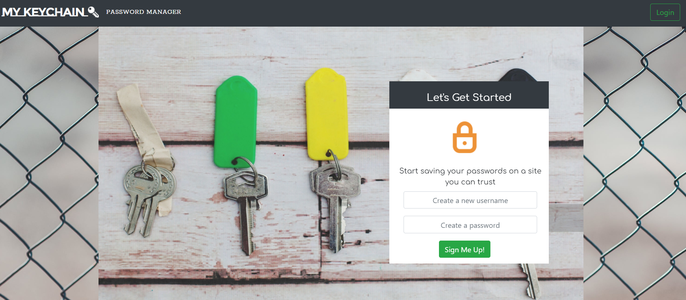
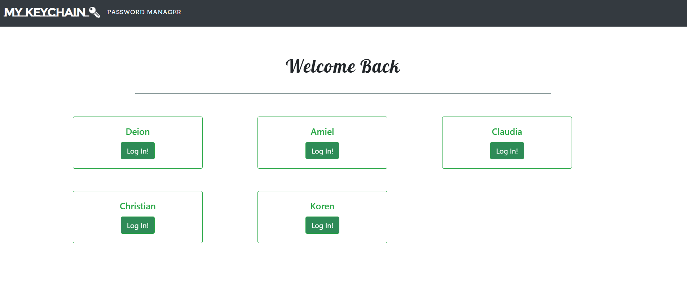
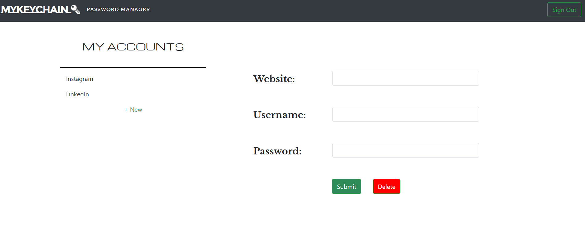

# myKeychain

Rutgers Coding Bootcamp Project 2

myKeychain is a full-featured CRUD application that stores users' usernames and passwords to different online accounts. 

## Getting Started

myKeychain can be used to:

  * `create a new user account`

  * `create new username and password for an online account`

  * `update username and password for an existing online account`

  * `delete an existing online account`

### Prerequisites

You will need to install the following to work on myKeychain:

```

   * [Express](npm i express)

   * [mySQL](npm i mysql)
   
```

### How To Use myKeychain

1. Go to the Heroku app
2. Create an account.

    

3. On the Log In page, click on your name.

    

4. Once on the dashboard, you can see your online accounts. You can create, update, and delete accounts.

    **Dashboard**

    

## Created By

* **Amiel Nicdao** 
* **Deion Aujero**
* **Christian Reyes**
* **Claudia Gutarra**

[GitHub](https://github.com/amielnicdao/keychain)

## Technologies

* Javascript
* Node.js
* Dependencies:
    * Express
    * mySQL
* API
* AJAX
* jQuery
* GSAP3
* MVC
* Heroku

## Future Development

* Authentication
* Be able to delete a user
* Logging in or signing up automatically directs user to the dashboard
* Enterprise solutions

## Acknowledgments

* Instructor
* TAs
* Groupmates
